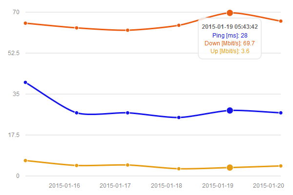

# Speedtests
Keep track of your internet speed over time.

## Requirements
Webserver with PHP 5+

## Usage
### Visualize log data of speed tests
- Clone repository to webserver
- Open web app in browser (e.g. http://example.com/speedtests)
- To remove the example entries delete or empty file "log.csv"

### Log speed tests (automatically)
Create a cron job which logs internet speed records to "log.csv" in this repository (gets created automatically, if it does not exist already) in the following format:

`<YYYY-MM-DD HH:MM:SS>,<Ping_in_ms>,<Download_Speed_in_Mbit/s>,<Upload_Speed_in_Mbit/s>`

e.g. `2015-01-15 05:40:32,39.991,65.34,6.61`

## TODO
- Show chart's y-axis values in intervals of 5 (0, 5, 10, 15, ...)

## External resources
- [morris.js](http://morrisjs.github.io/morris.js) ([Github](https://github.com/morrisjs/morris.js))
- [Raphaël](http://raphaeljs.com)
- [jQuery](http://jquery.com/) ([Github](https://github.com/jquery/jquery))
- [Add To Homescreen](http://cubiq.org/add-to-home-screen) ([Github](https://github.com/cubiq/add-to-homescreen))

## License
The MIT License (MIT)